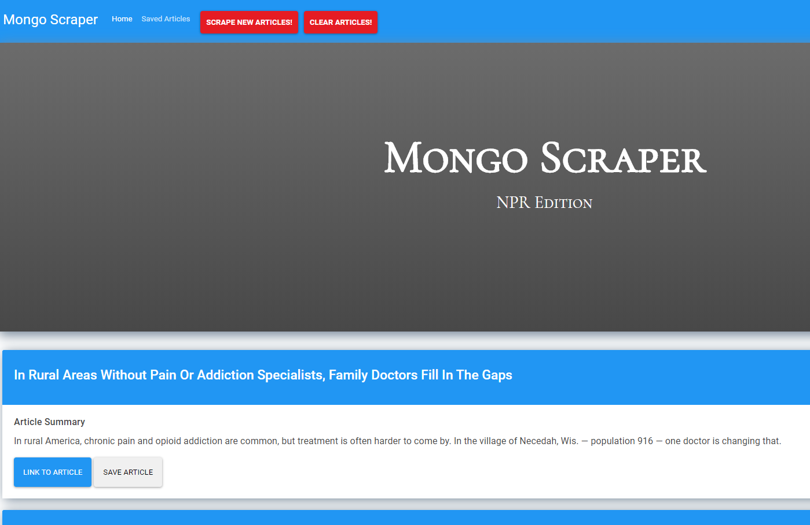

# News-Scraper
An application that scrapes a website for articles and allows a user to leave comments on them

Currently the scraper is only able to grab the first 20 articles of the website and have the ability save articles and then delete the saved articles from your saved page.

Check out the the site here:

https://pacific-hamlet-36269.herokuapp.com/

or install locally:

How to install:

npm i
npm i axios
npm i cheerio
npm i express
npm i express-handlebars
npm i morgan
npm i mongoose

